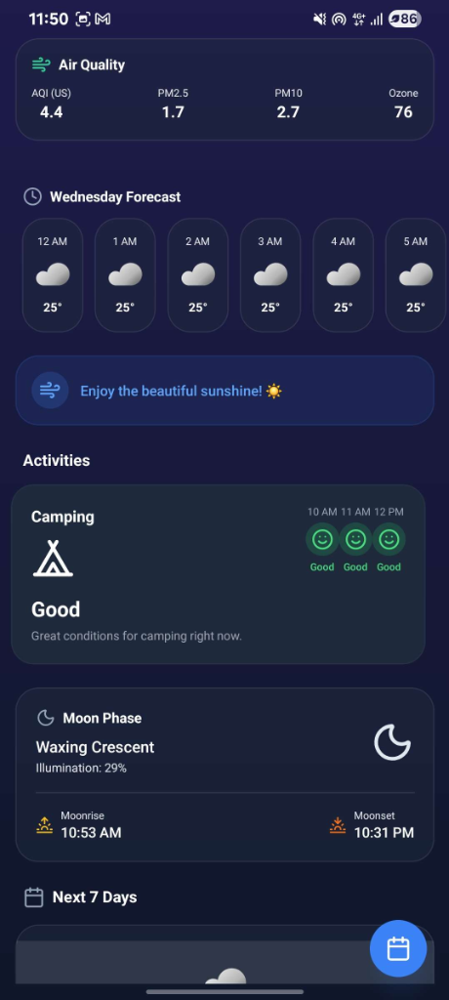
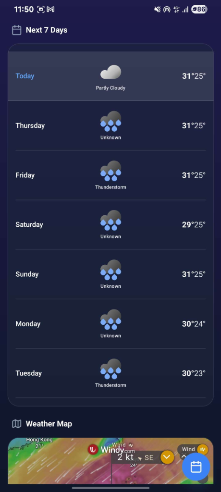
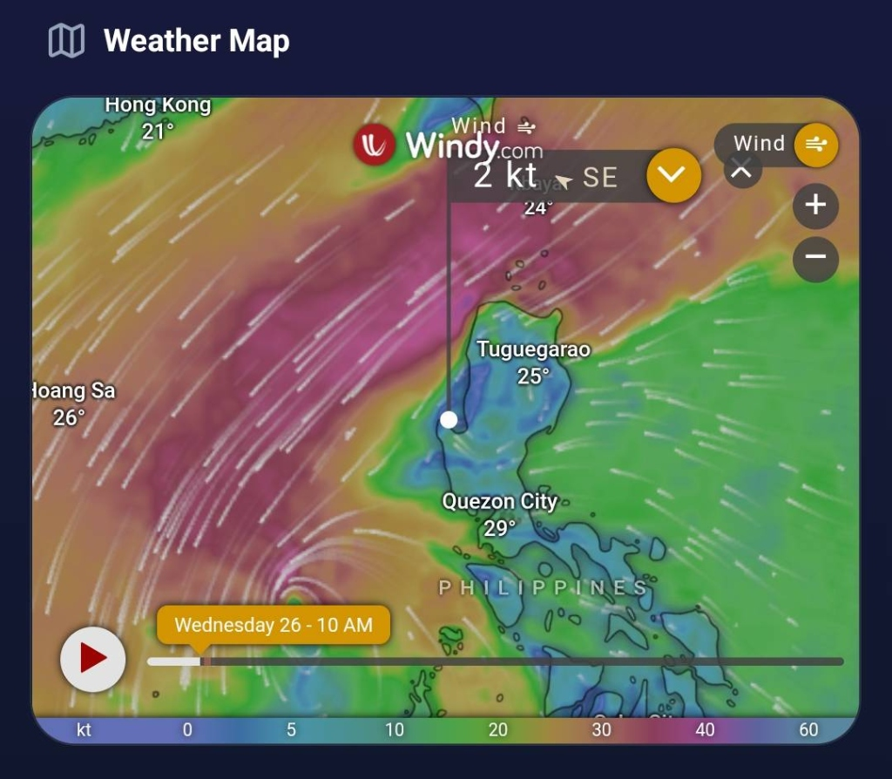
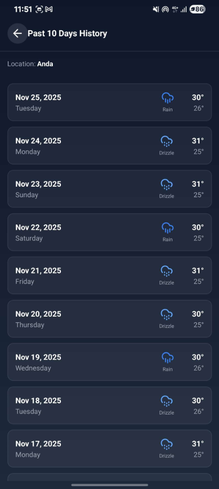

# 🌦️ Weather Android App

A beautiful, immersive weather application built with **React Native** and **Expo**. This app features dynamic animated backgrounds, real-time weather data, and a sleek, modern UI.

## ✨ Features

*   **Real-time Weather**: Accurate current conditions including temperature, wind, humidity, and precipitation.
*   **Dynamic Backgrounds**: Beautiful animated backgrounds that change based on the current weather conditions (Sunny, Rainy, Cloudy, Night, etc.).
*   **Hourly & Daily Forecasts**: Detailed forecasts to help you plan your day and week.
*   **Interactive UI**: Smooth animations and interactions powered by `react-native-reanimated`.
*   **Expanded Activity Suggestions**: Smart recommendations for outdoor activities including Running, Cycling, Gardening, Tennis, Badminton, Golf, Hiking, and Camping. 🎾🏸⛳🥾⛺
*   **Customizable Settings**: Toggle specific activities and the weather map visibility to personalize your experience.
*   **Weather Map**: Visual map integration to see weather patterns in your area.
*   **Save Locations**: Bookmark your favorite cities for quick access. 🔖
*   **Moon Phase**: Track the current moon phase and illumination.
*   **Offline Support**: Caches weather data for offline access.

## 🛠️ Tech Stack

*   **Framework**: [React Native](https://reactnative.dev/) with [Expo](https://expo.dev/)
*   **Styling**: [NativeWind](https://www.nativewind.dev/) (Tailwind CSS for React Native)
*   **Animations**: 
    *   [React Native Reanimated](https://docs.swmansion.com/react-native-reanimated/)
    *   [Lottie React Native](https://github.com/lottie-react-native/lottie-react-native)
*   **Icons**: [Lucide React Native](https://lucide.dev/guide/packages/lucide-react-native)
*   **Navigation**: [React Navigation](https://reactnavigation.org/)
*   **State Management**: React Context API

## 🚀 Getting Started

Follow these steps to run the project locally.

### Prerequisites

*   **Node.js** (v18 or newer recommended)
*   **npm** or **yarn**
*   **Expo Go** app installed on your Android device or an Android Emulator.

### Installation

1.  **Clone the repository:**

    ```bash
    git clone https://github.com/AkKennesu/Weather-Android-App.git
    cd Weather-Android-App
    ```

2.  **Install dependencies:**

    ```bash
    npm install
    ```

### Running the App

1.  **Start the development server:**

    ```bash
    npx expo start -c
    ```
    *(The `-c` flag clears the cache, which is recommended to avoid bundler issues)*

2.  **Open on Android:**
    *   **Physical Device**: Open the **Expo Go** app on your Android phone and scan the QR code displayed in the terminal.
    *   **Emulator**: Press `a` in the terminal to open the app in the Android Emulator.

## 📱 Screenshots

| Home Screen | Forecast & Air Quality | Activities & Moon |
|:---:|:---:|:---:|
|  |  |  |

| Weather Map | History | |
|:---:|:---:|:---:|
|  |  | |

## 🤝 Contributing

Contributions are welcome! Feel free to open an issue or submit a pull request.

## 📄 License

This project is open source and available under the [Apache License 2.0](LICENSE).
